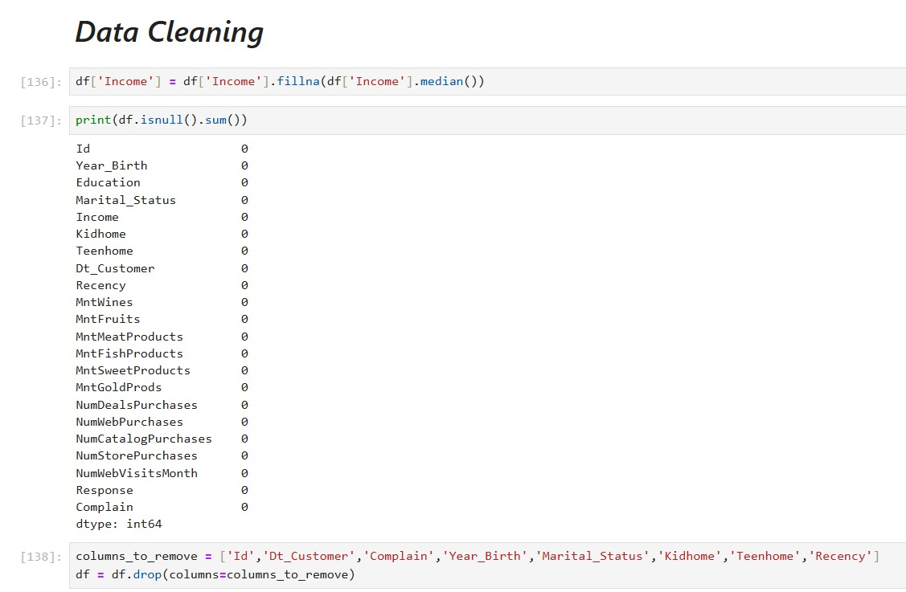
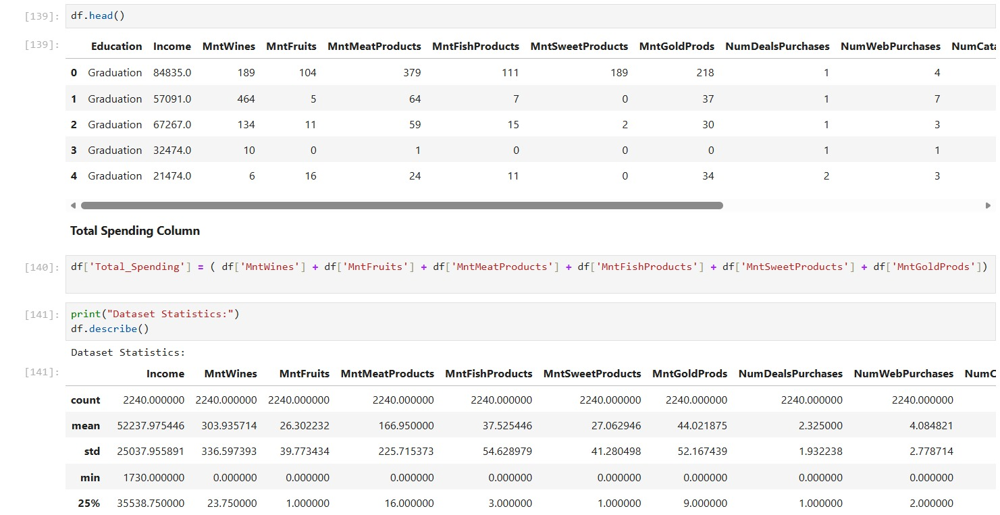
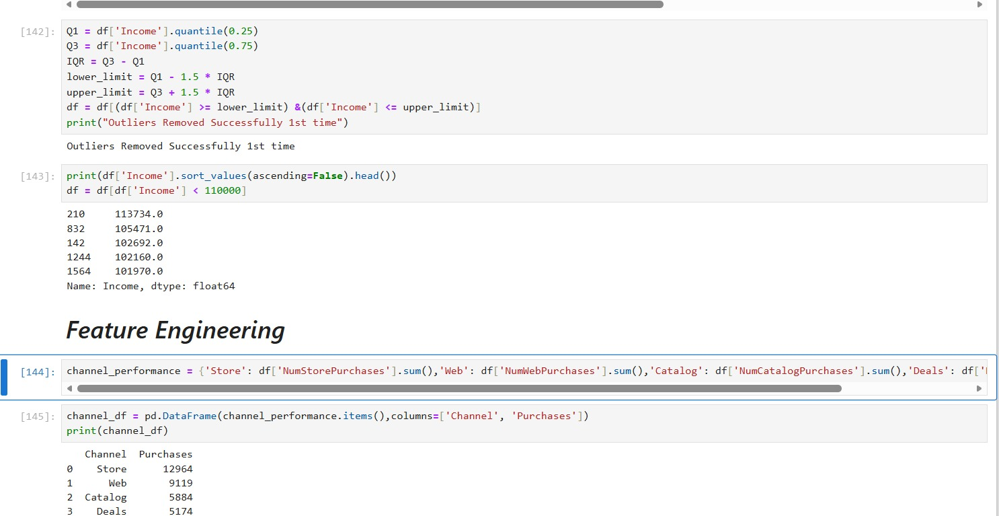
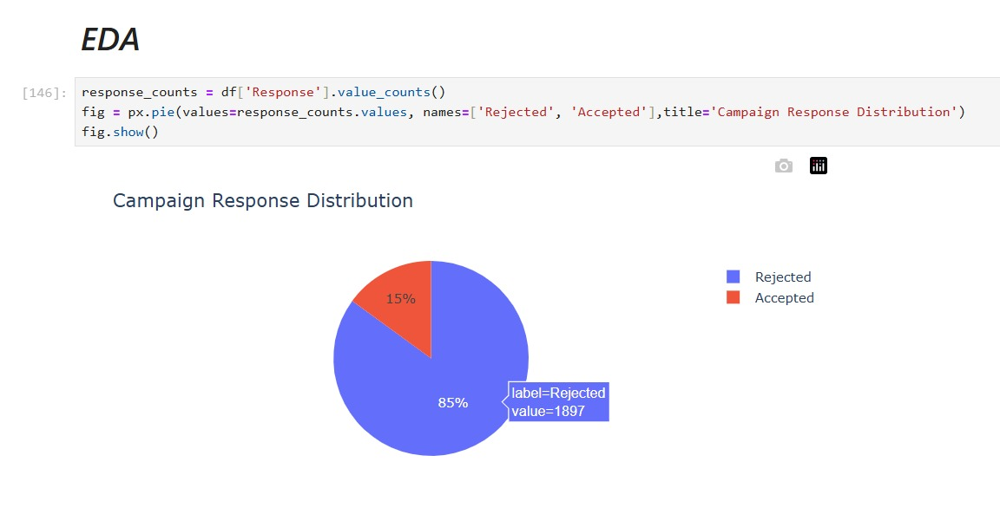
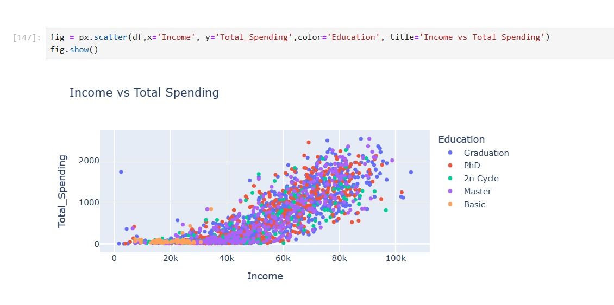
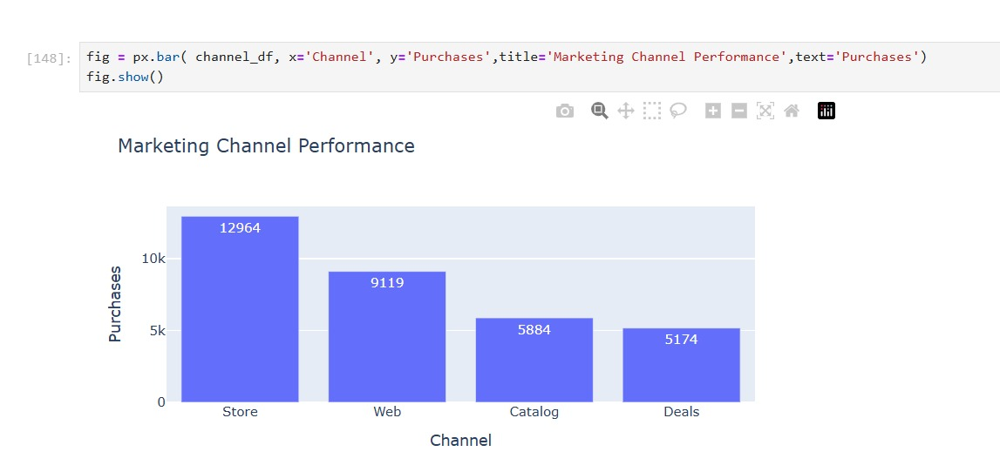
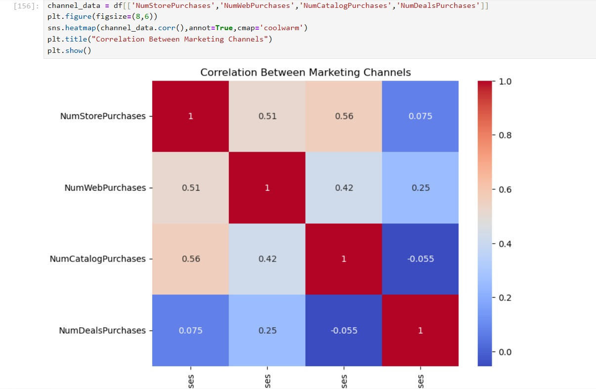
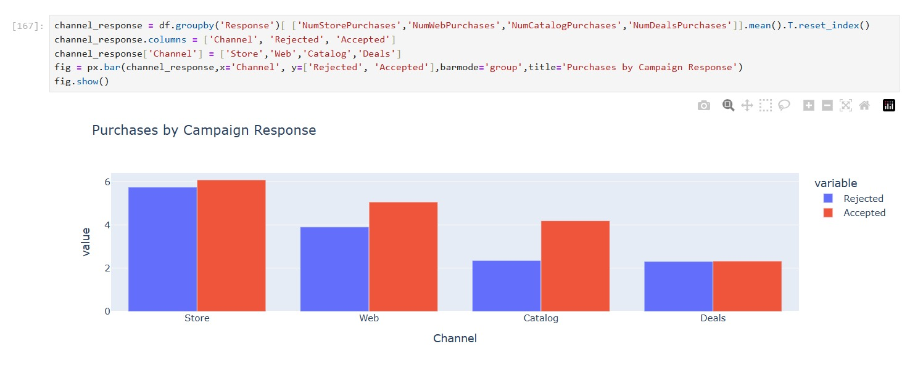
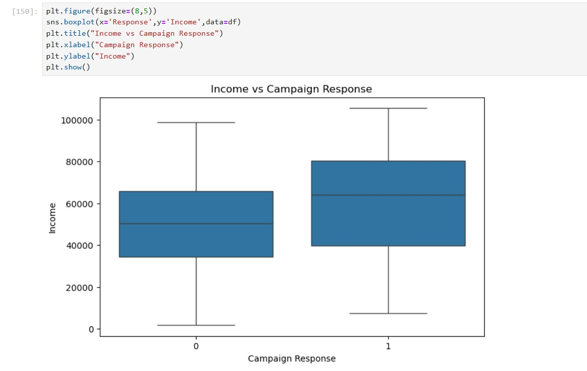

# 📊 SCT_DA_2 - Customer Personality Analysis using Python

## 📌 Overview
This project focuses on **Customer Personality Analysis** using Python to understand customer purchasing behavior and campaign effectiveness. The dataset was cleaned, transformed, and analyzed using Exploratory Data Analysis (EDA) techniques to generate meaningful business insights.

The project demonstrates the complete data analysis workflow, including data cleaning, feature engineering, visualization, and business insight generation.

---

## 🎯 Objectives
- Clean and preprocess customer data.
- Handle missing values and remove outliers.
- Perform feature engineering.
- Analyze customer spending patterns.
- Evaluate marketing channel performance.
- Study campaign response behavior.
- Generate business insights using data visualization.

---

## 🛠️ Tools & Technologies

- Python
- Pandas
- NumPy
- Matplotlib
- Seaborn
- Plotly
- Jupyter Notebook

---

## 📂 Dataset Features

The dataset contains customer information such as:

- Income
- Education
- Product Spending
- Store Purchases
- Web Purchases
- Catalog Purchases
- Deal Purchases
- Campaign Response
- Customer Demographics

---

## 🔄 Project Workflow

### 1️⃣ Data Cleaning
- Filled missing values using Median.
- Removed unnecessary columns.
- Checked for missing values.
- Removed outliers using the IQR Method.

### 2️⃣ Feature Engineering
- Created a **Total_Spending** column by combining all product spending categories.
- Calculated purchases across different marketing channels.

### 3️⃣ Exploratory Data Analysis (EDA)
Performed multiple analyses including:

- Campaign Response Distribution
- Income vs Total Spending
- Marketing Channel Performance
- Correlation Between Marketing Channels
- Purchases by Campaign Response
- Income vs Campaign Response

---

## 📊 Key Insights

- Approximately **85%** of customers did not respond to the campaign.
- Customers with higher income generally spend more.
- Store purchases are the most preferred purchasing channel.
- Deal purchases contribute the least.
- Campaign responders generally have higher income.
- Store, Web, and Catalog purchases show moderate positive correlation.

---

## 📈 Visualizations

### Data Cleaning


---

### Dataset Preview & Feature Engineering


---

### Outlier Removal


---

### Campaign Response Distribution


---

### Income vs Total Spending


---

### Marketing Channel Performance


---

### Correlation Between Marketing Channels


---

### Purchases by Campaign Response


---

### Income vs Campaign Response


---

## 🚀 Skills Demonstrated

- Data Cleaning
- Data Preprocessing
- Feature Engineering
- Exploratory Data Analysis (EDA)
- Data Visualization
- Statistical Analysis
- Outlier Detection
- Business Analytics
- Insight Generation

---

## 📁 Repository Structure

```
SCT_DA_2/
│── README.md
│── SCT_DA_2.ipynb
│── SCT_DA_2.html
│── 1.jpeg
│── 2.jpeg
│── 3.jpeg
│── 4.jpeg
│── 5.jpeg
│── 6.jpeg
│── 7.jpeg
│── 8.jpeg
│── 9.jpeg
```

---

## 🎯 Conclusion

This project demonstrates a complete end-to-end data analysis process using Python. From cleaning and transforming raw data to creating meaningful visualizations, the project provides actionable insights into customer behavior and marketing campaign performance.

---

## 👨‍💻 Author

**Arpita Yadav**

MBA (Finance & Business Analytics)

GitHub: https://github.com/ArpitaYadav07
